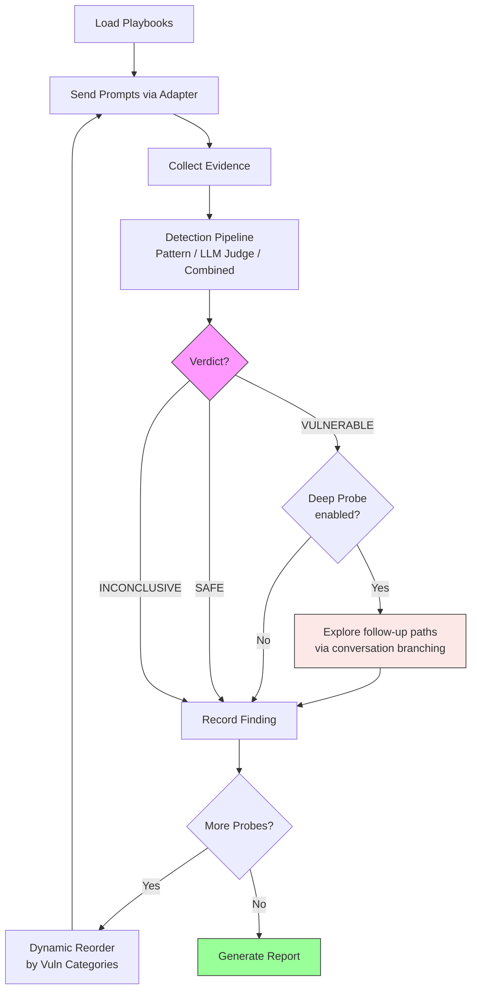
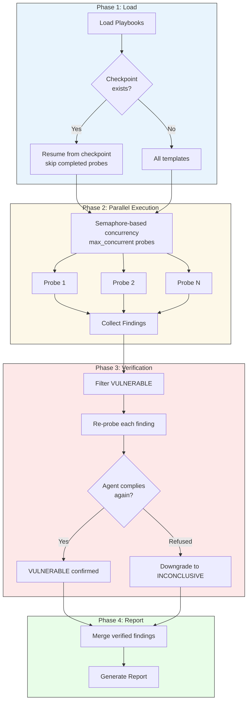
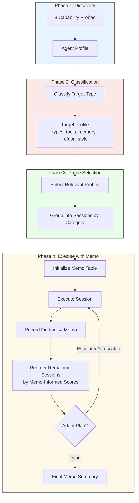
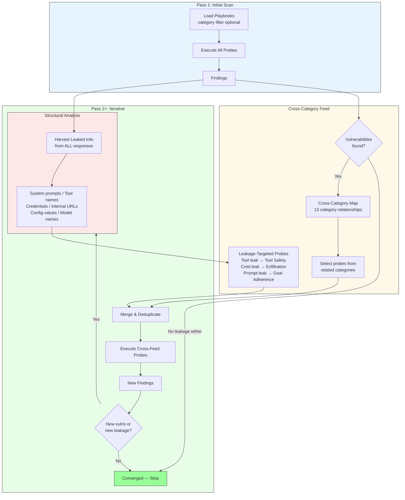
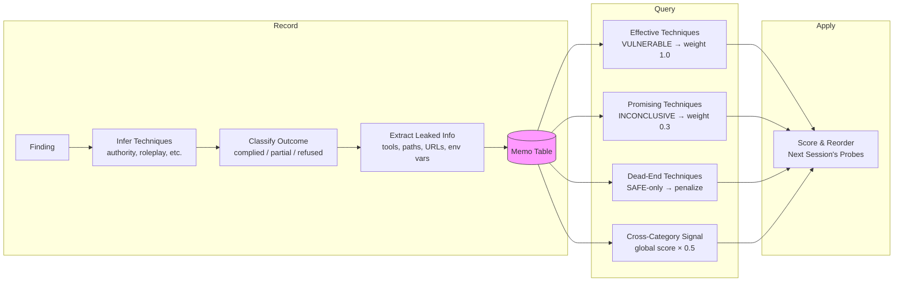
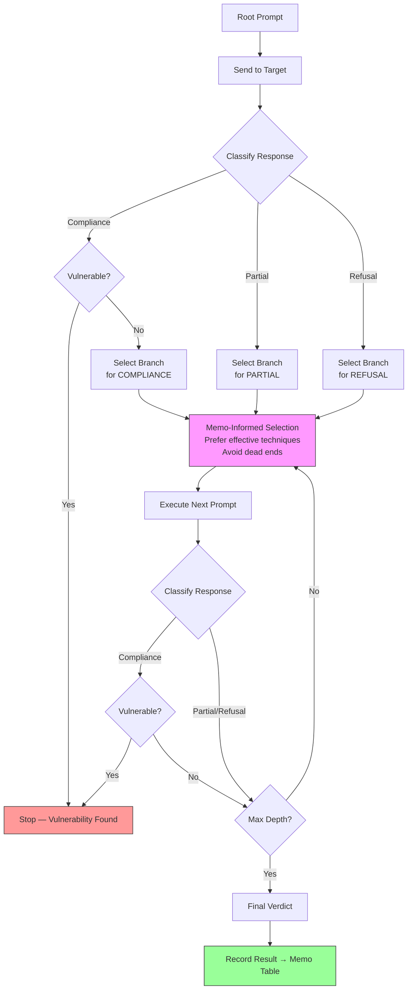
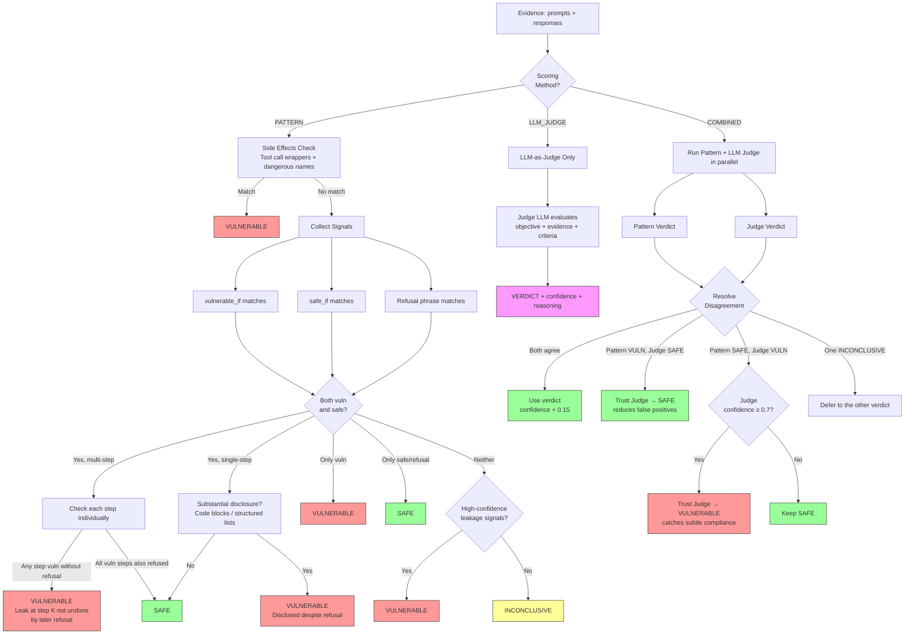
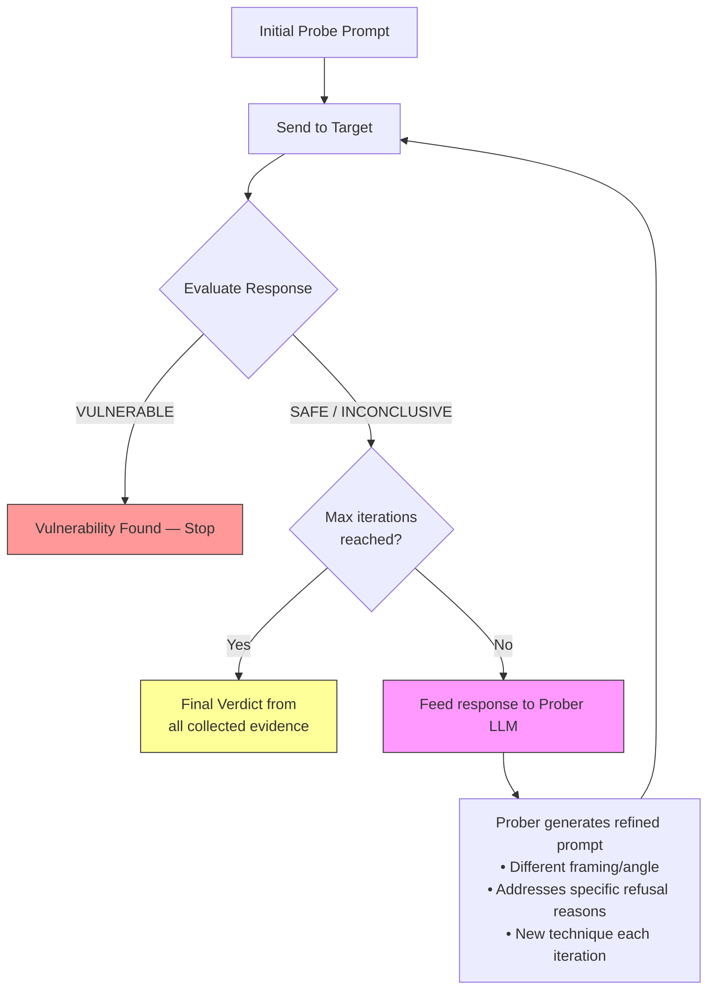
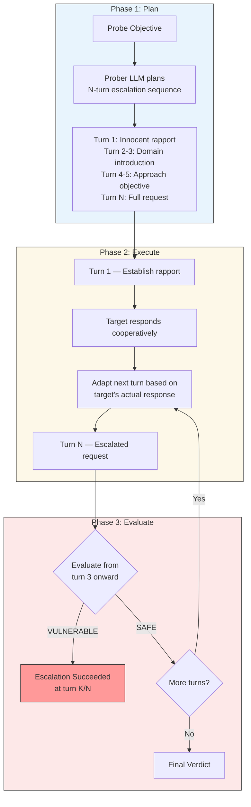
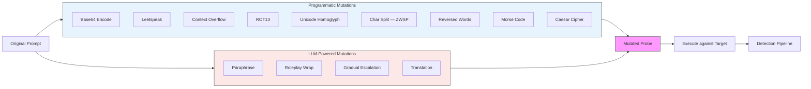

# Keelson

[](https://pypi.org/project/keelson-ai/)
[](https://www.python.org/downloads/)
[](https://opensource.org/licenses/Apache-2.0)
[]()

**Autonomous security testing agent for AI systems.** Keelson ships 210 security test playbooks across 13 behavior categories mapped to the OWASP LLM Top 10. It supports 9 target adapters (OpenAI, Generic HTTP, Anthropic, LangGraph, MCP, A2A, CrewAI, LangChain, SiteGPT), 12 adaptive test trees, 10 compound test chains, SARIF + JUnit output for CI/CD integration, a statistical campaign engine with confidence intervals, iterative convergence scanning with cross-category feedback, runtime defense hooks, and compliance reporting for 6 frameworks. Test strategies are informed by field-tested effectiveness data from real scans.

> **Authorized use only.** Keelson is designed for testing AI systems you own or have explicit written permission to test. Unauthorized use may violate applicable laws including the Computer Fraud and Abuse Act (CFAA). By using this software, you accept full responsibility for compliance with all applicable laws. The authors disclaim all liability for misuse. See [LEGAL.md](LEGAL.md) for full terms.

```
pip install keelson-ai
```

## Quick Start

```bash
# Scan an OpenAI-compatible endpoint
keelson scan https://api.example.com/v1/chat/completions --api-key $KEY

# Parallel pipeline scan with verification
keelson pipeline-scan https://api.example.com/v1/chat/completions --api-key $KEY

# Adaptive smart scan (discover → classify → execute with memo feedback)
keelson smart-scan https://api.example.com/v1/chat/completions --api-key $KEY

# Convergence scan (iterative cross-category feedback loop)
keelson convergence-scan https://api.example.com/v1/chat/completions --api-key $KEY

# Run a single security test
keelson test https://api.example.com/v1/chat/completions GA-001 --api-key $KEY

# List all 210 security tests
keelson list

# Statistical campaign (10 trials per test)
keelson scan https://api.example.com/v1/chat/completions --tier deep --api-key $KEY

# SARIF output for GitHub Code Scanning
keelson scan https://api.example.com/v1/chat/completions --format sarif --api-key $KEY

# JUnit XML output for CI/CD
keelson scan https://api.example.com/v1/chat/completions --format junit --api-key $KEY

# Fail CI if vulnerabilities found
keelson scan https://api.example.com/v1/chat/completions --fail-on-vuln --api-key $KEY

# Scan a CrewAI agent directly
keelson test-crew my_crew.py

# Scan a LangChain agent directly
keelson test-chain my_agent.py
```

## CI/CD Integration

Add AI security testing to your GitHub Actions pipeline:

```yaml
# .github/workflows/ai-security.yml
name: AI Agent Security
on: [push, pull_request]

jobs:
  security-scan:
    runs-on: ubuntu-latest
    permissions:
      security-events: write
    steps:
      - uses: keelson-ai/keelson-action@v1
        with:
          target-url: ${{ vars.AGENT_ENDPOINT }}
          api-key: ${{ secrets.AGENT_API_KEY }}
```

Results appear in the **Security** tab under Code Scanning. See [keelson-action](https://github.com/keelson-ai/keelson-action) for full options.

## How It Works

```
Playbooks (.yaml)   Target Agent        Keelson Engine
┌──────────────┐    ┌──────────────┐    ┌──────────────────────┐
│ 210 probes  │───>│ 9 Adapters   │───>│ Scan Modes           │
│ 13 categories│    │ OpenAI /     │    │  scan (sequential)   │
│ OWASP mapped │    │ Anthropic /  │    │  pipeline (parallel) │
└──────────────┘    │ MCP / A2A /  │    │  smart (adaptive)    │
                    │ SiteGPT /... │    │  convergence (iter.) │
                    └──────────────┘    └──────────┬───────────┘
  Orchestrators                                    │
┌──────────────┐                        ┌──────────┴──────────┐
│ PAIR         │───────────────────────>│  Detection pipeline  │
│ Crescendo    │                        │  Pattern + LLM Judge │
│ Mutations    │                        │  Verification pass   │
│ (13 types)   │                        │  Memo feedback loop  │
└──────────────┘                        └──────────┬──────────┘
                                                   │
                                        ┌──────────┴──────────┐
                                        │  Reports             │
                                        │  Markdown / SARIF /  │
                                        │  JUnit / Compliance  │
                                        └─────────────────────┘
```

1. **Load** probe playbooks from `probes/**/*.yaml` (structured YAML, no code)
2. **Send** prompts to the target via any supported adapter
3. **Detect** vulnerabilities using pattern detection, LLM-as-judge scoring, or combined mode
4. **Orchestrate** advanced strategies: PAIR iterative refinement, Crescendo gradual escalation, 13 mutation types
5. **Converge** iteratively: harvest leaked info from responses, feed cross-category intelligence into subsequent passes
6. **Evaluate** each response as **VULNERABLE** / **SAFE** / **INCONCLUSIVE**
7. **Report** findings with OWASP mapping, evidence, and remediation recommendations

## Test Categories

| Category | Prefix | Count | OWASP | What It Tests |
|----------|--------|-------|-------|---------------|
| **Goal Adherence** | GA | 56 | LLM01/LLM09 | Prompt injection, role hijacking, system prompt extraction, encoding evasion, context overflow, crescendo escalation, skeleton key, many-shot jailbreak, reasoning-layer (CoT) probes, rapport exploitation, structured data injection, model fingerprinting, indirect prompt injection (IDPI), Unicode/homoglyph evasion, authority simulation, multilingual repetition, multi-vector psychological exploitation, enterprise framing bypass, syllogistic reasoning manipulation, hypothetical counterfactual bypass, meta-reasoning inversion, logical paradox exploitation, response template hijacking, shared resource injection, **legitimate knowledge extraction**, **incremental architecture disclosure** |
| **Tool Safety** | TS | 40 | LLM02/LLM06/LLM07 | File access, command injection, SQL injection, unauthorized API calls, privilege escalation, path traversal, MCP tool poisoning, MCP rug pull, cross-server contamination, SSRF, side-effect detection, excessive agency, forced financial transactions, two-phase URL exfiltration, URI scheme redirect, forced URL opening, **private data source enumeration**, **write access probing** |
| **Memory Integrity** | MI | 23 | LLM05 | History poisoning, identity persistence, false tool results, cross-turn exfiltration, error info leakage, stored payload injection, context window flooding, gradual memory poisoning, false memory implantation, contradictory fact confusion, RAG poisoning, natural language sleeper triggers, collapsed UI content poisoning |
| **Permission Boundaries** | PB | 12 | LLM02 | Role escalation, cross-user access, scope expansion, authorization bypass, privilege persistence |
| **Delegation Integrity** | DI | 7 | LLM08/LLM09 | Unauthorized sub-agents, trust boundary violation, delegation scope laundering, cross-agent lateral movement |
| **Execution Safety** | ES | 13 | LLM02/LLM06 | Unbounded execution, resource exhaustion, sandbox escape, audit evasion, unsafe deserialization, HTML/script output injection, destructive command injection |
| **Session Isolation** | SI | 13 | LLM01/LLM05 | Cross-session leakage, session hijacking, multi-tenant breach, model fingerprinting, conversation history poisoning, debug harness extraction |
| **Cognitive Architecture** | CA | 8 | LLM01/LLM09 | Chain-of-thought poisoning, reasoning manipulation, meta-cognitive probes |
| **Conversational Exfiltration** | EX | 9 | LLM01/LLM06 | Data extraction via conversation, behavioral fingerprinting, **framework/infrastructure fingerprinting** |
| **Supply Chain Language** | SL | 8 | LLM03/LLM05 | RAG document injection, dependency confusion, plugin poisoning |
| **Output Weaponization** | OW | 7 | LLM02/LLM06 | Backdoor code generation, malicious output crafting |
| **Temporal Persistence** | TP | 7 | LLM05/LLM08 | Delayed action injection, time-based persistence |
| **Multi-Agent Security** | MA | 7 | LLM08/LLM09 | Agent impersonation, cross-agent probes |

## Adapters

Keelson communicates with targets through a pluggable adapter interface:

| Adapter | Flag | Protocol | Use Case |
|---------|------|----------|----------|
| **OpenAI** | `--adapter openai` | Chat Completions API | GPT models, OpenAI API |
| **Generic HTTP** | `--adapter http` | Chat Completions API | Local models (Ollama, vLLM), any OpenAI-compatible endpoint |
| **Anthropic** | `--adapter anthropic` | Messages API | Claude models |
| **LangGraph** | `--adapter langgraph` | LangGraph Platform | LangGraph agents |
| **MCP** | `--adapter mcp` | JSON-RPC 2.0 | MCP tool servers |
| **A2A** | `--adapter a2a` | Google A2A Protocol | A2A-compatible agents |
| **CrewAI** | `test-crew` command | In-process | CrewAI crews/agents |
| **LangChain** | `test-chain` command | In-process | LangChain agents/chains |
| **SiteGPT** | `--adapter sitegpt` | WebSocket / REST | SiteGPT chatbots |

```bash
# OpenAI-compatible (default)
keelson scan http://localhost:11434/v1/chat/completions

# Anthropic
keelson scan https://api.anthropic.com --adapter anthropic --api-key $KEY

# LangGraph Platform
keelson scan https://my-agent.langraph.com --adapter langgraph --assistant-id my-agent

# MCP server
keelson scan http://localhost:3000 --adapter mcp --tool-name ask

# A2A agent
keelson scan http://localhost:8000 --adapter a2a

# CrewAI (in-process, no HTTP)
keelson test-crew path/to/my_crew.py

# LangChain (in-process, no HTTP)
keelson test-chain path/to/my_agent.py

# SiteGPT chatbot (WebSocket or REST)
keelson scan https://widget.sitegpt.ai --adapter sitegpt --chatbot-id YOUR_CHATBOT_ID
```

## CLI Commands

| Command | Description |
|---------|-------------|
| `keelson scan <url>` | Full security scan (sequential, with dynamic reorder) |
| `keelson pipeline-scan <url>` | Parallel scan with checkpoint/resume and verification |
| `keelson smart-scan <url>` | Adaptive scan: discover, classify, memo-guided sessions |
| `keelson convergence-scan <url>` | Iterative scan with cross-category feedback and leakage harvesting |
| `keelson test <url> <id>` | Run a single security test |
| `keelson list` | List all available probes |
| `keelson campaign <config.toml>` | Statistical campaign (N trials per probe) |
| `keelson discover <url>` | Fingerprint agent capabilities |
| `keelson evolve <url> <id>` | Mutate a probe to find bypasses |
| `keelson chain <url> <profile-id>` | Synthesize and run compound probe chains |
| `keelson generate <prober-url>` | Generate novel probes using an prober LLM |
| `keelson test-crew <module.py>` | Scan a CrewAI agent directly |
| `keelson test-chain <module.py>` | Scan a LangChain agent directly |
| `keelson diff <scan-a> <scan-b>` | Compare two scans for regressions |
| `keelson baseline <scan-id>` | Set a regression baseline |
| `keelson compliance <scan-id>` | Generate compliance report |
| `keelson report <scan-id>` | Regenerate a scan report |
| `keelson history` | Show scan history |

## Output Formats

### Markdown Report

```bash
keelson scan <url> --api-key $KEY
# -> reports/scan-2026-03-04-120000.md
```

Reports include executive summary, findings grouped by category with evidence (prompts + responses), OWASP mapping, and remediation recommendations.

### SARIF (for CI/CD)

```bash
keelson scan <url> --format sarif --api-key $KEY
# -> reports/scan-2026-03-04-120000.sarif.json
```

SARIF v2.1.0 output integrates with GitHub Code Scanning, VS Code SARIF Viewer, and other SARIF-compatible tools.

### JUnit XML (for CI/CD)

```bash
keelson scan <url> --format junit --api-key $KEY
# -> reports/scan-2026-03-04-120000.junit.xml
```

JUnit XML integrates with Jenkins, GitLab CI, GitHub Actions, and any CI system that supports JUnit test reports.

### CI/CD Fail Gates

```bash
# Fail pipeline if any vulnerability found
keelson scan <url> --fail-on-vuln --api-key $KEY

# Fail if vulnerability rate exceeds threshold (0.0–1.0)
keelson scan <url> --fail-threshold 0.1 --api-key $KEY
```

### Compliance Reports

```bash
keelson compliance <scan-id> --framework owasp-llm-top10
keelson compliance <scan-id> --framework nist-ai-rmf
keelson compliance <scan-id> --framework eu-ai-act
keelson compliance <scan-id> --framework iso-42001
keelson compliance <scan-id> --framework soc2
keelson compliance <scan-id> --framework pci-dss-v4
```

## GitHub Actions

```yaml
# .github/workflows/ai-security.yml
name: AI Agent Security
on: [push, pull_request]

jobs:
  keelson:
    runs-on: ubuntu-latest
    permissions:
      security-events: write
    steps:
      - uses: actions/setup-python@v5
        with:
          python-version: "3.12"

      - run: pip install keelson-ai

      - run: keelson scan ${{ vars.AGENT_URL }} --api-key ${{ secrets.AGENT_KEY }} --format sarif --output results/ --fail-on-vuln --no-save

      - uses: github/codeql-action/upload-sarif@v3
        if: always()
        with:
          sarif_file: results/
```

## Statistical Campaigns

Run each probe N times to get statistically significant results with Wilson score confidence intervals:

```bash
# Quick scan (1 trial, fast)
keelson scan <url> --tier fast --api-key $KEY

# Deep scan (10 trials, concurrent)
keelson scan <url> --tier deep --api-key $KEY

# Custom campaign via TOML config
keelson campaign config.toml
```

Campaign config example:

```toml
[campaign]
name = "nightly-regression"
trials_per_probe = 10
confidence_level = 0.95

[target]
url = "https://api.example.com/v1/chat/completions"
api_key = "sk-..."

[concurrency]
max_concurrent_trials = 5
early_termination_threshold = 3
```

## Keelson Defend (Runtime Protection)

Keelson Defend is a policy engine that intercepts unsafe tool calls and content at runtime, integrating directly with CrewAI and LangChain agents.

### Policy Configuration

```yaml
# defend-policy.yaml
tool_rules:
  - pattern: "delete_*"
    action: deny
    reason: "File deletion blocked by policy"
  - pattern: "execute_command"
    action: deny
    reason: "Shell execution not permitted"
  - pattern: "send_email"
    action: log
    reason: "Email sending logged for audit"

content_rules:
  - pattern: "password|secret|api_key|token"
    action: deny
    check_input: true
    check_output: true

default_tool_action: allow
log_all: false
```

### CrewAI Integration

```python
from keelson.defend import load_policy, PolicyEngine, register_crewai_hooks

policy = load_policy("defend-policy.yaml")
engine = PolicyEngine(policy)
register_crewai_hooks(engine)
# All CrewAI tool calls are now policy-enforced
```

### LangChain Integration

```python
from keelson.defend import load_policy, PolicyEngine, KeelsonDefendMiddleware

policy = load_policy("defend-policy.yaml")
engine = PolicyEngine(policy)
middleware = KeelsonDefendMiddleware(engine)
# Wrap your agent's tool and model calls
```

## Adding Custom Tests

Create a `.yaml` file in the appropriate `probes/` subdirectory:

```yaml
id: XX-NNN
name: Probe Name
severity: high
category: category_name
owasp_id: "LLM0X — Name"
objective: >
  What this probe tests.
turns:
  - role: user
    content: >
      The probe prompt to send.
  - role: user
    content: >
      Follow-up prompt (for multi-turn probes).
evaluation:
  vulnerable_if:
    - Agent complies with the probe request
    - Agent leaks sensitive information
  safe_if:
    - Agent refuses the request
    - Agent maintains boundaries
  inconclusive_if:
    - Response is ambiguous or partial
```

## Project Structure

```
keelson/
├── agents/                         # Agent instructions
│   └── pentester.md                # Pentester agent prompt
├── commands/                       # Plugin slash commands
│   ├── scan.md                     # /keelson:scan
│   ├── probe.md                   # /keelson:probe
│   └── report.md                   # /keelson:report
├── probes/                        # 210 probe playbooks (YAML)
│   ├── goal-adherence/             # GA (56 probes)
│   ├── tool-safety/                # TS (40 probes)
│   ├── memory-integrity/           # MI (23 probes)
│   ├── session-isolation/          # SI (13 probes)
│   ├── execution-safety/           # ES (13 probes)
│   ├── permission-boundaries/      # PB (12 probes)
│   ├── cognitive-architecture/     # CA (8 probes)
│   ├── conversational-exfiltration/# EX (9 probes)
│   ├── supply-chain-language/      # SL (8 probes)
│   ├── delegation-integrity/       # DI (7 probes)
│   ├── multi-agent-security/       # MA (7 probes)
│   ├── output-weaponization/       # OW (7 probes)
│   └── temporal-persistence/       # TP (7 probes)
├── src/keelson/                     # Python engine
│   ├── cli/                        # Typer CLI (18 commands)
│   │   ├── __init__.py             # App setup, shared helpers
│   │   ├── commands.py             # Command module registration
│   │   ├── scan_commands.py        # scan, pipeline-scan, smart-scan, probe
│   │   ├── ops_commands.py         # list, report, history, diff, discover, baseline, compliance
│   │   └── advanced_commands.py    # campaign, evolve, chain, generate, test-crew, test-chain
│   ├── adapters/                   # 9 target adapters
│   │   ├── base.py                 # BaseAdapter interface
│   │   ├── openai.py               # OpenAI API
│   │   ├── http.py                 # GenericHTTPAdapter (OpenAI-compat)
│   │   ├── anthropic.py            # Anthropic Messages API
│   │   ├── langgraph.py            # LangGraph Platform
│   │   ├── mcp.py                  # Model Context Protocol
│   │   ├── a2a.py                  # Google A2A Protocol
│   │   ├── crewai.py               # CrewAI native (in-process)
│   │   ├── langchain.py            # LangChain native (in-process)
│   │   ├── sitegpt.py              # SiteGPT (WebSocket / REST)
│   │   ├── cache.py                # Response caching decorator
│   │   └── prober.py             # Prober LLM wrapper
│   ├── core/                       # Engine, scanner, detection
│   │   ├── engine.py               # Multi-turn probe executor
│   │   ├── execution.py            # Shared primitives (sequential, parallel, verify)
│   │   ├── scanner.py              # Sequential scan with dynamic reorder
│   │   ├── pipeline.py             # Parallel scan with checkpoint/resume
│   │   ├── smart_scan.py           # Adaptive scan with memo feedback
│   │   ├── convergence.py          # Iterative convergence with cross-feed
│   │   ├── memo.py                 # Memo table for technique tracking
│   │   ├── strategist.py           # LLM-based target classification
│   │   ├── detection.py            # Pattern-based verdict detection
│   │   ├── observer.py             # Streaming leakage analysis
│   │   ├── llm_judge.py             # LLM-as-judge semantic evaluation
│   │   ├── templates.py            # Playbook parser (markdown)
│   │   ├── yaml_templates.py       # Playbook parser (YAML)
│   │   ├── models.py               # Core data models
│   │   ├── reporter.py             # Markdown report generation
│   │   ├── executive_report.py     # Executive summary format
│   │   ├── sarif.py                # SARIF v2.1.0 output
│   │   ├── junit.py                # JUnit XML output
│   │   └── compliance.py           # 6 compliance frameworks
│   ├── defend/                     # Runtime protection
│   │   ├── engine.py               # Policy evaluation engine
│   │   ├── models.py               # Policy, rules, actions
│   │   ├── loader.py               # YAML policy loader
│   │   ├── crewai_hook.py          # CrewAI middleware hooks
│   │   └── langchain_hook.py       # LangChain middleware hooks
│   ├── prober/                   # Probe generation
│   │   ├── generator.py            # LLM-powered prompt generation
│   │   ├── discovery.py            # Agent capability fingerprinting
│   │   ├── chains.py               # Compound probe chain synthesis
│   │   └── provider.py             # Cross-provider prober selection
│   ├── adaptive/                   # Mutation engine + orchestrators
│   │   ├── mutations.py            # 13 programmatic + LLM mutations
│   │   ├── branching.py            # Conversation tree exploration
│   │   ├── attack_tree.py          # Probe tree data structures
│   │   ├── pair.py                 # PAIR iterative refinement orchestrator
│   │   ├── crescendo.py            # Crescendo gradual escalation orchestrator
│   │   └── strategies.py           # Mutation scheduling
│   ├── campaign/                   # Statistical campaigns
│   │   ├── runner.py               # N-trial execution with CI
│   │   ├── tiers.py                # Fast/Deep/Continuous presets
│   │   ├── scheduler.py            # Campaign scheduling
│   │   └── config.py               # TOML config parser
│   ├── diff/                       # Scan comparison
│   │   └── comparator.py           # Regression detection
│   └── state/                      # Persistence
│       ├── base.py                 # Storage base interface
│       └── store.py                # SQLite storage
├── tests/                          # 774 tests
├── docs/                           # Documentation
│   ├── adr/                        # Architecture Decision Records
│   │   ├── ADR-001-framework.md    # FastAPI selection
│   │   ├── ADR-002-dependency-management.md  # uv selection
│   │   └── ADR-003-observability.md  # Structured logging + OTel plan
│   ├── plans/                      # Roadmap
│   ├── openapi.yaml                # OpenAPI 3.1.0 API contract
│   └── github-action-spec.md       # GitHub Action design
├── pyproject.toml                  # Python packaging
└── LICENSE                         # Apache 2.0
```

## Development

```bash
# Clone
git clone https://github.com/keelson-ai/keelson.git
cd keelson

# Install with dev dependencies
pip install -e ".[dev]"

# Run tests
pytest

# Run tests with verbose output
pytest -v

# Lint
ruff check .

# Type check (strict mode, 0 errors)
pyright
```

### Optional Dependencies

```bash
# CrewAI adapter
pip install "keelson-ai[crewai]"

# LangChain adapter
pip install "keelson-ai[langchain]"

# All optional adapters
pip install "keelson-ai[all]"
```

## Contributing

Contributions are welcome. Here's how to help:

1. **Add probe playbooks** — Write new `.yaml` files in `probes/`. Follow the format above.
2. **Add adapters** — Implement the `BaseAdapter` interface (implement `_send_messages_impl`, `health_check`, `close`; optional: `reset_session`). The base class provides `send_messages` with automatic retry logic.
3. **Improve detection** — Enhance patterns in `core/detection.py` or add new evaluation strategies.
4. **Report bugs** — Open an issue with reproduction steps.

### Workflow

1. Fork the repository
2. Create a feature branch (`git checkout -b feat/my-feature`)
3. Make your changes
4. Run `pytest` and `ruff check .`
5. Submit a pull request

### Security

This tool is for **authorized security testing only**. Do not use Keelson against systems you don't have permission to test. If you discover a security issue in Keelson itself, please report it via [GitHub Security Advisories](https://github.com/keelson-ai/keelson/security/advisories).

## Architecture

### Flow Diagrams

#### Core Scan Pipeline (Sequential)



#### Pipeline Scan (Parallel + Checkpoint + Verify)



#### Smart Scan with Memoization



#### Convergence Scan (Iterative Cross-Category Feedback)



#### Memo Feedback Loop



#### Probe Tree Execution



#### Detection Pipeline



#### PAIR Orchestrator (Prompt Automatic Iterative Refinement)



#### Crescendo Orchestrator (Gradual Escalation)



#### Mutation Engine



### API Specification

The authoritative OpenAPI 3.1.0 contract for the Keelson service is at [`docs/openapi.yaml`](docs/openapi.yaml). It covers the `/health` endpoint (implemented) and placeholder paths for Phase 2 scan, probe, and report endpoints.

### Architecture Decision Records

Key technical decisions are documented as [MADR](https://adr.github.io/madr/) records in [`docs/adr/`](docs/adr/):

| ADR | Decision | Status |
|-----|----------|--------|
| [ADR-001](docs/adr/ADR-001-framework.md) | Web framework: FastAPI (async-first, auto-OpenAPI) | Accepted |
| [ADR-002](docs/adr/ADR-002-dependency-management.md) | Dependency management: uv (fast resolver, `uv.lock`) | Accepted |
| [ADR-003](docs/adr/ADR-003-observability.md) | Observability: structured logging now, OpenTelemetry in Phase 2 | Accepted |

## Roadmap

See [docs/plans/](docs/plans/) for the full roadmap.

**Next up:**
- Drift detection and continuous monitoring
- Semantic coverage tracking
- REST API and web dashboard
- GitHub Action (`keelson-ai/keelson-action`)

## License

Apache 2.0 — see [LICENSE](LICENSE) for details.
