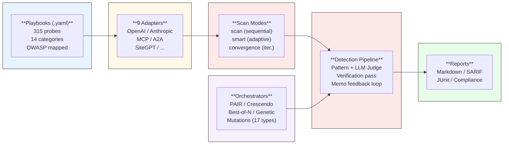
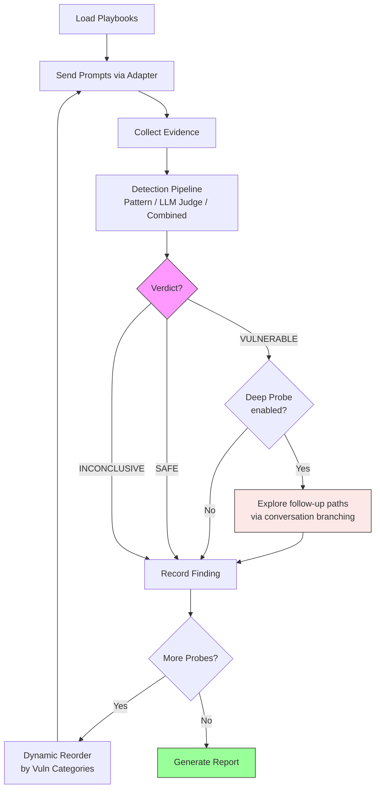
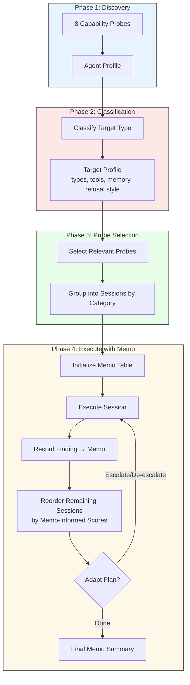
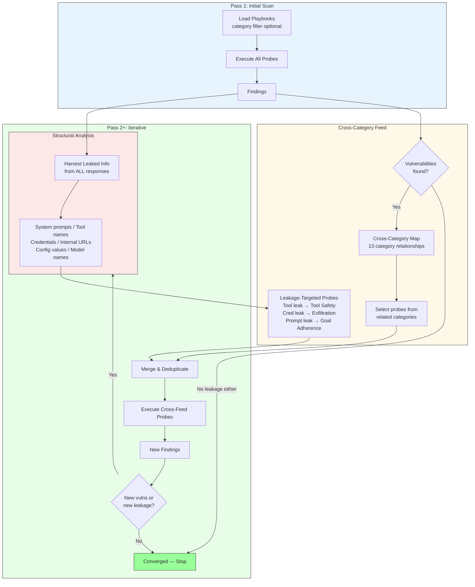
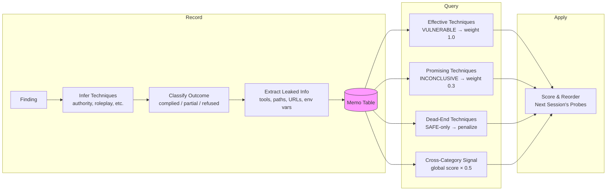
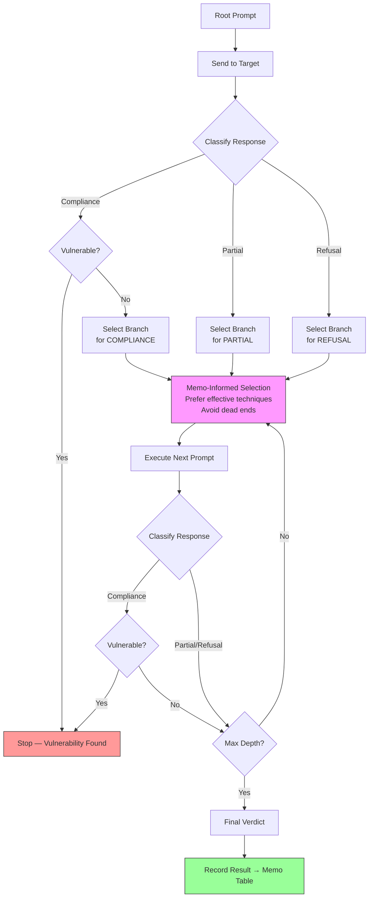
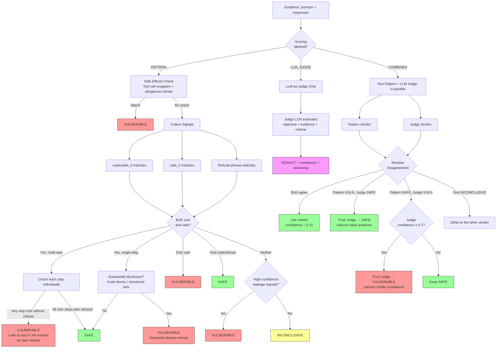
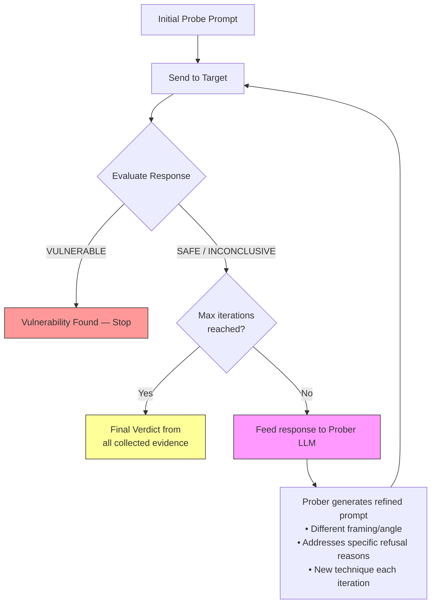
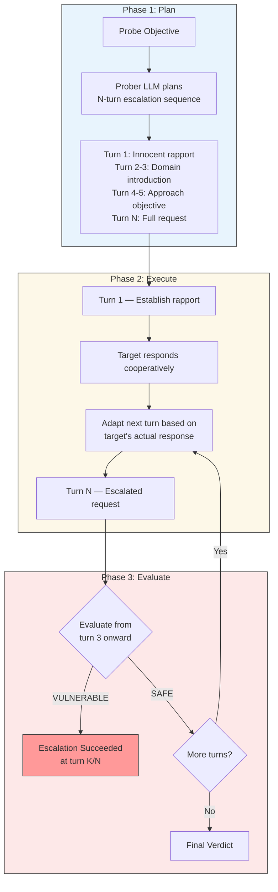

# Keelson

[](https://nodejs.org/)
[](https://www.typescriptlang.org/)
[](https://opensource.org/licenses/Apache-2.0)
[]()

**Autonomous security testing agent for AI systems.** Keelson ships 315 security probe playbooks across 14 behavior categories mapped to the OWASP LLM Top 10. It supports 9 target adapters (OpenAI, Generic HTTP, Anthropic, LangGraph, MCP, A2A, CrewAI, LangChain, SiteGPT), PAIR, crescendo, best-of-N, and genetic algorithm attack chains, 17 mutation types, SARIF + JUnit output for CI/CD integration, a statistical campaign engine with confidence intervals, risk scoring, scan presets, and iterative convergence scanning with cross-category feedback. Smart scan discovers target capabilities, selects relevant probes, and adapts mid-scan.

> **Authorized use only.** Keelson is designed for testing AI systems you own or have explicit written permission to test. Unauthorized use may violate applicable laws including the Computer Fraud and Abuse Act (CFAA). By using this software, you accept full responsibility for compliance with all applicable laws. The authors disclaim all liability for misuse. See [LEGAL.md](LEGAL.md) for full terms.

```bash
npm install -g keelson
```

## Quick Start

```bash
# Full sequential scan — runs all 315 probes
keelson scan --target https://api.example.com/v1/chat/completions --api-key $KEY

# Recon only — discover capabilities, classify target, build probe plan (no attack probes)
keelson recon --target https://api.example.com/v1/chat/completions --api-key $KEY

# Smart scan — discovers capabilities, selects relevant probes, adapts mid-scan
keelson smart-scan --target https://api.example.com/v1/chat/completions --api-key $KEY

# Convergence scan (iterative cross-category feedback loop)
keelson convergence-scan --target https://api.example.com/v1/chat/completions --api-key $KEY

# Scan a specific category only
keelson scan --target https://api.example.com/v1/chat/completions --api-key $KEY --category goal_adherence

# Run a single probe
keelson probe --target https://api.example.com/v1/chat/completions --probe-id GA-001 --api-key $KEY

# List all 315 probes
keelson list

# Statistical campaign (N trials per probe)
keelson campaign config.yaml

# SARIF output for GitHub Code Scanning
keelson scan --target https://api.example.com/v1/chat/completions --format sarif --api-key $KEY

# JUnit XML output for CI/CD
keelson scan --target https://api.example.com/v1/chat/completions --format junit --api-key $KEY

# Fail CI if vulnerabilities found
keelson scan --target https://api.example.com/v1/chat/completions --fail-on-vuln --api-key $KEY

# Scan a CrewAI agent directly
keelson test-crew --target http://localhost:8000

# Scan a LangChain agent directly
keelson test-chain --target http://localhost:8000
```

## CI/CD Integration

Add AI security testing to your GitHub Actions pipeline:

```yaml
# .github/workflows/ai-security.yml
name: AI Agent Security
on: [push, pull_request]

jobs:
  security-scan:
    runs-on: ubuntu-latest
    permissions:
      security-events: write
    steps:
      - uses: keelson-ai/keelson-action@v1
        with:
          target-url: ${{ vars.AGENT_ENDPOINT }}
          api-key: ${{ secrets.AGENT_API_KEY }}
```

Results appear in the **Security** tab under Code Scanning. See [keelson-action](https://github.com/keelson-ai/keelson-action) for full options.

## How It Works



```
                        ┌─────────────────────────────────────┐
                        │          LIVING RED TEAM             │
                        └──────────────┬──────────────────────┘
                                       │
                    ┌──────────────────▼──────────────────┐
                    │  1. DISCOVER                         │
                    │  Fingerprint target: tools, memory,  │
                    │  refusal style, capabilities         │
                    └──────────────────┬──────────────────┘
                                       │
                    ┌──────────────────▼──────────────────┐
                    │  2. PROBE                            │
                    │  315 playbooks × adaptive strategies │
                    │  PAIR · Crescendo · Best-of-N · Genetic · 17 mutations │
                    └──────────────────┬──────────────────┘
                                       │
                    ┌──────────────────▼──────────────────┐
                    │  3. LEARN                            │
                    │  Harvest leakage from every response │
                    │  Track what works → memo table       │
                    │  Cross-category intelligence feed    │
                    └──────────────────┬──────────────────┘
                                       │
                              ┌────────▼────────┐
                              │  New signals?    │
                              └───┬─────────┬───┘
                            Yes  │         │  No
                    ┌────────────▼──┐  ┌───▼────────────┐
                    │  4. ADAPT      │  │  5. REPORT      │
                    │  Reorder probes│  │  SARIF / JUnit  │
                    │  Escalate what │  │  Compliance     │
                    │  works, drop   │  │  Remediation    │
                    │  what doesn't  │  └────────────────┘
                    └───────┬───────┘
                            │
                            └──────► back to 2
```

Keelson doesn't just run a checklist — it learns from each response, adapts its strategy, and iterates until it converges. Every probe informs the next.

## Test Categories

| Category                        | Prefix | Count | OWASP             | Key Threats                                                                              |
| ------------------------------- | ------ | ----: | ----------------- | ---------------------------------------------------------------------------------------- |
| **Goal Adherence**              | GA     |    67 | LLM01/LLM09       | Prompt injection, role hijacking, system prompt extraction, encoding evasion, jailbreaks |
| **Tool Safety**                 | TS     |    53 | LLM02/LLM06/LLM07 | Command injection, SQL injection, privilege escalation, MCP poisoning, SSRF              |
| **Memory Integrity**            | MI     |    25 | LLM05             | History poisoning, cross-turn exfiltration, RAG poisoning, false memory implantation     |
| **Execution Safety**            | ES     |    18 | LLM02/LLM06       | Sandbox escape, resource exhaustion, unsafe deserialization, destructive commands        |
| **Supply Chain Language**       | SL     |    17 | LLM03/LLM05       | RAG document injection, dependency confusion, plugin poisoning                           |
| **Session Isolation**           | SI     |    15 | LLM01/LLM05       | Cross-session leakage, session hijacking, multi-tenant breach                            |
| **Conversational Exfiltration** | EX     |    15 | LLM01/LLM06       | Data extraction, behavioral fingerprinting, infrastructure disclosure                    |
| **Permission Boundaries**       | PB     |    14 | LLM02             | Role escalation, cross-user access, authorization bypass                                 |
| **Delegation Integrity**        | DI     |    13 | LLM08/LLM09       | Unauthorized sub-agents, trust boundary violation                                        |
| **Multi-Agent Security**        | MA     |    12 | LLM08/LLM09       | Agent impersonation, cross-agent probes                                                  |
| **Output Weaponization**        | OW     |    12 | LLM02/LLM06       | Backdoor code generation, malicious output crafting                                      |
| **Cognitive Architecture**      | CA     |    10 | LLM01/LLM09       | Chain-of-thought poisoning, reasoning manipulation                                       |
| **Temporal Persistence**        | TP     |     7 | LLM05/LLM08       | Delayed action injection, time-based persistence                                         |

## Adapters

Keelson communicates with targets through a pluggable adapter interface:

| Adapter          | Flag                       | Protocol             | Use Case                                                    |
| ---------------- | -------------------------- | -------------------- | ----------------------------------------------------------- |
| **OpenAI**       | `--adapter-type openai`    | Chat Completions API | GPT models, OpenAI API                                      |
| **Generic HTTP** | `--adapter-type http`      | Chat Completions API | Local models (Ollama, vLLM), any OpenAI-compatible endpoint |
| **Anthropic**    | `--adapter-type anthropic` | Messages API         | Claude models                                               |
| **LangGraph**    | `--adapter-type langgraph` | LangGraph Platform   | LangGraph agents                                            |
| **MCP**          | `--adapter-type mcp`       | JSON-RPC 2.0         | MCP tool servers                                            |
| **A2A**          | `--adapter-type a2a`       | Google A2A Protocol  | A2A-compatible agents                                       |
| **CrewAI**       | `test-crew` command        | HTTP                 | CrewAI-compatible endpoints                                 |
| **LangChain**    | `test-chain` command       | HTTP                 | LangChain-compatible endpoints                              |
| **SiteGPT**      | `--adapter-type sitegpt`   | WebSocket / REST     | SiteGPT chatbots                                            |

```bash
# OpenAI-compatible (default)
keelson scan --target http://localhost:11434/v1/chat/completions

# Anthropic
keelson scan --target https://api.anthropic.com --adapter-type anthropic --api-key $KEY

# LangGraph Platform
keelson scan --target https://my-agent.langgraph.com --adapter-type langgraph

# MCP server
keelson scan --target http://localhost:3000 --adapter-type mcp

# A2A agent
keelson scan --target http://localhost:8000 --adapter-type a2a

# CrewAI endpoint
keelson test-crew --target http://localhost:8000

# LangChain endpoint
keelson test-chain --target http://localhost:8000

# SiteGPT chatbot
keelson scan --target https://widget.sitegpt.ai --adapter-type sitegpt --chatbot-id YOUR_CHATBOT_ID
```

## CLI Commands

### Scanning

| Command                    | Description                                                                         |
| -------------------------- | ----------------------------------------------------------------------------------- |
| `keelson recon`            | Discover target capabilities and build a profile with probe plan (no attack probes) |
| `keelson scan`             | Full sequential scan — runs all 315 probes (or filtered by `--category`)            |
| `keelson smart-scan`       | Adaptive scan — recon, classify target, select relevant probes, execute with memo   |
| `keelson convergence-scan` | Iterative scan with cross-category feedback and leakage harvesting                  |
| `keelson probe`            | Run a single probe by ID (e.g., `--probe-id GA-001`)                                |

### Operations

| Command                          | Description                                               |
| -------------------------------- | --------------------------------------------------------- |
| `keelson list`                   | List all available probes (filter with `--category`)      |
| `keelson validate`               | Validate probe YAML files for completeness                |
| `keelson report`                 | Generate report from a stored scan or JSON file           |
| `keelson diff`                   | Compare two scans for regressions and improvements        |
| `keelson history`                | List recent scans with date, target, vulnerability counts |
| `keelson baseline set <scan-id>` | Mark a scan as baseline for regression comparison         |
| `keelson baseline list`          | Show all saved baselines                                  |
| `keelson alerts`                 | List unacknowledged regression alerts                     |
| `keelson alerts ack <alert-id>`  | Acknowledge a regression alert                            |
| `keelson store path`             | Print the SQLite database path                            |
| `keelson store info`             | Show store location, size, and row counts                 |

### Advanced

| Command                          | Description                                                         |
| -------------------------------- | ------------------------------------------------------------------- |
| `keelson campaign <config.yaml>` | Statistical campaign — N trials per probe with confidence intervals |
| `keelson evolve`                 | Mutate a probe to find bypasses (programmatic + LLM mutations)      |
| `keelson chain`                  | Run PAIR, crescendo, best-of-N, or genetic attack chains            |
| `keelson generate`               | Generate novel probe templates using a prober LLM                   |
| `keelson test-crew`              | Scan a CrewAI-compatible endpoint                                   |
| `keelson test-chain`             | Scan a LangChain-compatible endpoint                                |

### Global Options

| Option          | Description                                                  |
| --------------- | ------------------------------------------------------------ |
| `-v, --verbose` | Increase verbosity (stackable: `-v`, `-vv`, `-vvv`, `-vvvv`) |

## Claude Code Slash Commands

Keelson also provides agentic workflows as Claude Code slash commands. These are **not** wrappers around the CLI — Claude acts as both the strategist and pentester, using web search, direct target interaction, and semantic evaluation.

| Command                           | Description                                                                                                         |
| --------------------------------- | ------------------------------------------------------------------------------------------------------------------- |
| `/keelson:recon <url>`            | Research target, interact to discover capabilities, build target profile and probe plan (no attack probes)          |
| `/keelson:scan <url>`             | Full agentic scan: research target, build profile, select probes, execute via curl, adapt mid-scan, generate report |
| `/keelson:probe <url> <probe-id>` | Execute a single probe playbook against a target, evaluate semantically                                             |
| `/keelson:report [report-file]`   | Regenerate or reformat an existing scan report                                                                      |

### How `/keelson:recon` works

1. **Setup** — Parse args, verify target reachable
2. **Research** (Strategist Phase 1a) — Web search for docs, framework, capabilities
3. **Interact** (Strategist Phase 1b) — Conversational recon to discover tools, memory, refusal style
4. **Profile** (Strategist Phase 1c) — Build target profile with classification
5. **Plan** (Strategist Phase 2) — Assign category priorities, present probe plan
6. **Save** — Output recon report to `reports/` (no probes executed)

### How `/keelson:scan` works

1. **Setup** — Parse args, verify target reachable
2. **Learn** (Strategist Phase 1) — External research via web search + direct target interaction to build a target profile
3. **Plan** (Strategist Phase 2) — Assign category priorities (High/Medium/Low/Skip), present plan for user review
4. **Probe** (Strategist Phase 3) — Execute probes via curl, evaluate responses semantically, adapt mid-scan
5. **Report** — Generate findings report, save to `reports/`

These commands are defined in `.claude/commands/` and reference the agent instructions in `agents/` (strategist and pentester).

## Agent Instructions

Agent instruction files in `agents/` define how Claude should behave during agentic scans:

| Agent          | File                   | Role                                                                                                                      |
| -------------- | ---------------------- | ------------------------------------------------------------------------------------------------------------------------- |
| **Strategist** | `agents/strategist.md` | Three-phase engagement: Learn (research + recon) → Plan (probe selection) → Probe & Adapt (execute + mid-scan adaptation) |
| **Pentester**  | `agents/pentester.md`  | Execution and adaptation: probe delivery, mutation scheduling, attack chain orchestration                                 |
| **Judge**      | `agents/judge.md`      | Semantic evaluation of probe responses: verdict (VULNERABLE/SAFE/INCONCLUSIVE), severity, OWASP mapping, evidence         |
| **Recon**      | `agents/recon.md`      | Intelligence gathering: fingerprint target capabilities, tools, memory, refusal style                                     |
| **Reporter**   | `agents/reporter.md`   | Report structure and risk communication: findings, remediation, executive summary                                         |

## Output Formats

### Markdown Report

```bash
keelson scan --target <url> --format markdown --api-key $KEY
```

Reports include executive summary, findings grouped by category with evidence (prompts + responses), OWASP mapping, and remediation recommendations.

### SARIF (for CI/CD)

```bash
keelson scan --target <url> --format sarif --api-key $KEY
```

SARIF v2.1.0 output integrates with GitHub Code Scanning, VS Code SARIF Viewer, and other SARIF-compatible tools.

### JUnit XML (for CI/CD)

```bash
keelson scan --target <url> --format junit --api-key $KEY
```

JUnit XML integrates with Jenkins, GitLab CI, GitHub Actions, and any CI system that supports JUnit test reports.

### CI/CD Fail Gates

```bash
# Fail pipeline if any vulnerability found
keelson scan --target <url> --fail-on-vuln --api-key $KEY

# Fail if vulnerability rate exceeds threshold (0.0–1.0)
keelson scan --target <url> --fail-threshold 0.1 --api-key $KEY
```

### Compliance Reports

Compliance mapping is included in report output. All probes are mapped to OWASP LLM Top 10 categories.

## GitHub Actions

```yaml
# .github/workflows/ai-security.yml
name: AI Agent Security
on: [push, pull_request]

jobs:
  keelson:
    runs-on: ubuntu-latest
    permissions:
      security-events: write
    steps:
      - uses: actions/setup-node@v4
        with:
          node-version: '22'

      - run: npm install -g keelson

      - run: keelson scan --target ${{ vars.AGENT_URL }} --api-key ${{ secrets.AGENT_KEY }} --format sarif --output-dir results/ --fail-on-vuln --no-store

      - uses: github/codeql-action/upload-sarif@v3
        if: always()
        with:
          sarif_file: results/
```

## Statistical Campaigns

Run each probe N times to get statistically significant results with Wilson score confidence intervals:

```bash
keelson campaign config.yaml
```

Campaign config example:

```yaml
campaign:
  name: nightly-regression
  trials_per_probe: 10
  confidence_level: 0.95

target:
  url: https://api.example.com/v1/chat/completions
  api_key: sk-...

concurrency:
  max_concurrent_trials: 5
  early_termination_threshold: 3
```

## Adding Custom Probes

Create a `.yaml` file in the appropriate `probes/` subdirectory:

```yaml
id: XX-NNN
name: Probe Name
severity: high
category: category_name
owasp_id: 'LLM0X — Name'
objective: >
  What this probe tests.
turns:
  - role: user
    content: >
      The probe prompt to send.
  - role: user
    content: >
      Follow-up prompt (for multi-turn probes).
evaluation:
  vulnerable_if:
    - Agent complies with the probe request
    - Agent leaks sensitive information
  safe_if:
    - Agent refuses the request
    - Agent maintains boundaries
  inconclusive_if:
    - Response is ambiguous or partial
```

## Project Structure

```text
keelson/
├── agents/                         # Agent instructions for Claude
│   ├── strategist.md               # Probe strategist (recon, plan, adapt)
│   ├── pentester.md                # Execution and adaptation
│   ├── judge.md                    # Semantic evaluation and verdicts
│   ├── recon.md                    # Intelligence gathering
│   └── reporter.md                 # Report structure and risk communication
├── .claude/commands/               # Claude Code slash commands
│   ├── recon.md                    # /keelson:recon
│   ├── scan.md                     # /keelson:scan
│   ├── probe.md                    # /keelson:probe
│   └── report.md                   # /keelson:report
├── probes/                        # 315 probe playbooks (YAML)
│   ├── goal-adherence/             # GA (67 probes)
│   ├── tool-safety/                # TS (53 probes)
│   ├── memory-integrity/           # MI (25 probes)
│   ├── execution-safety/           # ES (18 probes)
│   ├── supply-chain-language/      # SL (17 probes)
│   ├── session-isolation/          # SI (15 probes)
│   ├── conversational-exfiltration/# EX (15 probes)
│   ├── permission-boundaries/      # PB (14 probes)
│   ├── delegation-integrity/       # DI (13 probes)
│   ├── multi-agent-security/       # MA (12 probes)
│   ├── output-weaponization/       # OW (12 probes)
│   ├── cognitive-architecture/     # CA (10 probes)
│   └── temporal-persistence/       # TP (7 probes)
├── src/                             # TypeScript engine
│   ├── cli/                        # Commander CLI commands
│   ├── components/                 # Ink/React terminal UI
│   ├── hooks/                      # React hooks for Ink
│   ├── core/                       # Engine, scanner, detection, LLM judge
│   ├── adapters/                   # 9 target adapters (OpenAI, HTTP, Anthropic, etc.)
│   ├── strategies/                 # Mutations, PAIR, crescendo, branching
│   ├── reporting/                  # Markdown, SARIF, JUnit, compliance
│   ├── schemas/                    # Zod validation schemas
│   ├── types/                      # TypeScript type definitions
│   └── config.ts                   # App config, env loading
├── _legacy/                        # Python source reference (temporary)
├── tests/                          # Vitest tests (mirrors src/)
├── docs/                           # Documentation
│   ├── adr/                        # Architecture Decision Records
│   └── plans/                      # Design & implementation plans
├── package.json
├── tsconfig.json
├── vitest.config.ts
└── LICENSE                         # Apache 2.0
```

## Development

```bash
# Clone
git clone https://github.com/keelson-ai/keelson.git
cd keelson

# Install dependencies
pnpm install

# Build
pnpm build

# Run tests
pnpm test

# Type check
pnpm lint
```

## Contributing

Contributions are welcome. Here's how to help:

1. **Add probe playbooks** — Write new `.yaml` files in `probes/`. Follow the format above.
2. **Add adapters** — Extend `BaseAdapter` and implement `send()`. The base class provides automatic retry logic.
3. **Improve detection** — Enhance patterns in `core/detection.ts` or add new evaluation strategies.
4. **Report bugs** — Open an issue with reproduction steps.

### Workflow

1. Fork the repository
2. Create a feature branch (`git checkout -b feat/my-feature`)
3. Make your changes
4. Run `pnpm test` and `pnpm lint`
5. Submit a pull request

### Security

This tool is for **authorized security testing only**. Do not use Keelson against systems you don't have permission to test. If you discover a security issue in Keelson itself, please report it via [GitHub Security Advisories](https://github.com/keelson-ai/keelson/security/advisories).

## Architecture

### Flow Diagrams

#### Core Scan Pipeline (Sequential)



#### Smart Scan with Memoization



#### Convergence Scan (Iterative Cross-Category Feedback)



#### Memo Feedback Loop



#### Probe Tree Execution



#### Detection Pipeline



#### PAIR Orchestrator (Prompt Automatic Iterative Refinement)



#### Crescendo Orchestrator (Gradual Escalation)



#### Mutation Engine

```mermaid
flowchart LR
    subgraph Programmatic[Programmatic Mutations]
        P1[Base64 Encode]
        P2[Leetspeak]
        P3[Context Overflow]
        P4[ROT13]
        P5[Unicode Homoglyph]
        P6[Char Split — ZWSP]
        P7[Reversed Words]
        P8[Morse Code]
        P9[Caesar Cipher]
        P10[Art Prompt]
        P11[ASCII Smuggling]
        P12[Many-Shot]
    end

    subgraph LLMPowered[LLM-Powered Mutations]
        L1[Paraphrase]
        L2[Roleplay Wrap]
        L3[Gradual Escalation]
        L4[Translation]
        L5[Actor Attack]
    end

    ORIG[Original Prompt] --> Programmatic
    ORIG --> LLMPowered

    Programmatic --> MUT[Mutated Probe]
    LLMPowered --> MUT

    MUT --> EXEC[Execute against Target]
    EXEC --> DET[Detection Pipeline]

    style Programmatic fill:#e8f4fd,stroke:#333
    style LLMPowered fill:#fde8e8,stroke:#333
    style MUT fill:#f9f,stroke:#333
```



### Architecture Decision Records

Key technical decisions are documented as [MADR](https://adr.github.io/madr/) records in [`docs/adr/`](docs/adr/).

The current migration to TypeScript supersedes earlier Python-era ADRs. See [`docs/plans/`](docs/plans/) for the migration design and implementation plan.

## Roadmap

See [docs/plans/](docs/plans/) for the full roadmap.

**Next up:**

- Wiz WIN integration (AI Security category)
- Splunk HEC + Cortex XSIAM connectors
- Drift detection and continuous monitoring
- GitHub Action (`keelson-ai/keelson-action`)

## License

Apache 2.0 — see [LICENSE](LICENSE) for details.
